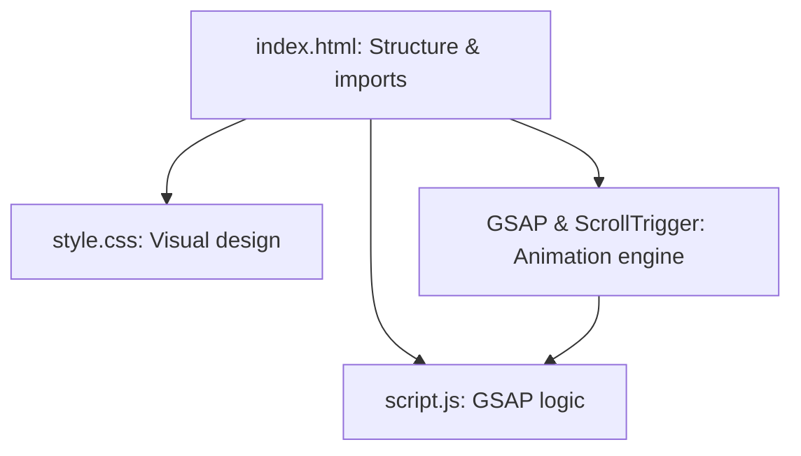

# GSAP ScrollTrigger Smooth Animation Demo 🚀

This project demonstrates how to use [GSAP](https://greensock.com/gsap/) and [ScrollTrigger](https://greensock.com/scrolltrigger/) to create visually engaging, scroll-activated animations with a modern look. Featuring a bold dark theme, custom fonts, and intuitive layout, it highlights how to animate elements as users scroll through different page sections.

---

## What’s in This Demo? 📦

- **index.html**: Provides the page structure, imports styles, fonts, GSAP, and your animation script.
- **style.css**: Delivers a contemporary, high-contrast design with centered, impactful content.
- **script.js**: Handles GSAP animation logic, including ScrollTrigger-based triggers and transformations.

---

## index.html

This HTML file is the entry point. It organizes the content into scrollable sections and loads external resources needed for styling and animation.

```html
<!DOCTYPE html>
<html lang="en">
<head>
  <meta charset="UTF-8">
  <meta name="viewport" content="width=device-width, initial-scale=1.0">
  <!-- Google Fonts: Poppins -->
  <link rel="preconnect" href="https://fonts.googleapis.com">
  <link rel="preconnect" href="https://fonts.gstatic.com" crossorigin>
  <link href="https://fonts.googleapis.com/css2?family=Poppins:wght@100;200;300;400;500;600;700;800;900&display=swap" rel="stylesheet">
  <link rel="stylesheet" href="style.css">
  <title>Document</title>
</head>
<body>
  <!-- Page Sections -->
  <div class="page1"><div class="box"></div></div>
  <div class="page2"><div class="box"></div></div>
  <div class="page3"><div class="box"></div></div>
  <div class="page4"></div>
  <!-- GSAP and ScrollTrigger -->
  <script src="https://cdnjs.cloudflare.com/ajax/libs/gsap/3.12.5/gsap.min.js" crossorigin="anonymous"></script>
  <script src="https://cdnjs.cloudflare.com/ajax/libs/gsap/3.12.5/ScrollTrigger.min.js" crossorigin="anonymous"></script>
  <script src="script.js"></script>
</body>
</html>
```

### Structure and Flow

- **Font Loading**: Imports the Poppins font for a polished, modern appearance.
- **Style Linking**: Connects `style.css` for the custom dark theme and layout.
- **Section Layout**: Four `.pageX` `<div>`s; first three each contain a `.box` for animation.
- **Animation Libraries**: Loads GSAP and ScrollTrigger from CDN, then your custom `script.js`.
- **Mobile Friendly**: Uses viewport meta for responsive scaling.

#### Main Elements Table

| Element                 | Role                                                   |
|-------------------------|--------------------------------------------------------|
| `<div class="pageX">`   | Full-page section, each with unique background color   |
| `<div class="box">`     | Animated square inside first three pages               |
| `<link ...>`            | Fonts and stylesheet                                  |
| `<script ...>`          | GSAP core, ScrollTrigger plugin, animation logic      |

---

## style.css

This file styles the overall page, each scrollable section, and the animated boxes, ensuring a unified look and great user experience.

```css
* {
  margin: 0;
  padding: 0;
  box-sizing: border-box;
  font-family: 'Poppins';
}

body {
  width: 100%;
  height: 100vh;
  background-color: #000;
  color: white;
}

.circle {
  border-radius: 50%;
  width: 300px;
  height: 300px;
  background-color: rgb(43, 85, 201);
}

.box1, .box2, .box3, .box {
  border-radius: 0.3rem;
  width: 300px;
  height: 300px;
  margin-bottom: 10px;
}
.box1 { background-color: red; }
.box2 { background-color: royalblue; }
.box3 { background-color: aquamarine; }
.box  { background-color: crimson; }

.page1 {
  height: 100%;
  width: 100%;
  background-color: lightblue;
  display: flex;
  align-items: center;
  justify-content: center;
}
.page2 {
  height: 100%;
  width: 100%;
  background-color: rgb(84, 104, 194);
  display: flex;
  align-items: center;
  justify-content: center;
}
.page3 {
  height: 100%;
  width: 100%;
  background-color: rgb(41, 194, 245);
  display: flex;
  align-items: center;
  justify-content: flex-start;
  padding: 30px;
}
.page4 {
  height: 100%;
  width: 100%;
  background-color: rgb(24, 133, 170);
  display: flex;
  align-items: center;
  justify-content: center;
}
```

### Key Styling Decisions

- **Global Reset**: Removes default margin/padding, applies custom font everywhere.
- **Body**: Black background, white text, full viewport.
- **Sections**: `.page1`–`.page4` each fill the viewport, with unique background colors for visual separation.
- **.box**: 300x300px, slightly rounded, bright color (crimson), centered in each section.
- **Flexbox Layout**: Ensures `.box` is always centered (or left-aligned with padding in `.page3`).

#### Main Classes Table

| Selector        | Purpose                                    |
|-----------------|--------------------------------------------|
| `.box`          | Main animated square, styled vividly       |
| `.page1-4`      | Each scrollable section, unique background |
| `.circle`       | For optional circular animated elements    |

---

## script.js

This JavaScript file is where the magic happens: it defines how and when elements animate as the user scrolls.

```js
// GSAP animation for the first box: pops in with scale and spin
gsap.from('.page1 .box', {
  scale: 0,
  rotate: 360,
  duration: 1,
  delay: 1
});

// GSAP animation for the second box: same effect, but triggered on scroll
gsap.from('.page2 .box', {
  scale: 0,
  rotate: 360,
  duration: 1,
  delay: 1,
  scrollTrigger: {
    trigger: '.page2 .box',
    scroller: 'body',
    // markers: true, // Uncomment for debugging
    start: 'top 50%',
    end: 'top 30%',
    scrub: 5
  }
});

// GSAP animation for the third box: slides to the right, pinned during scroll
gsap.to('.page3 .box', {
  x: 400,
  duration: 2,
  scrollTrigger: {
    trigger: '.page3 .box',
    scroller: 'body',
    // markers: true, // Uncomment for debugging
    start: 'top 60%',
    end: 'top 30%',
    scrub: true,
    pin: true
  }
});
```

### Animation Flow

1. **Page 1**:  
   - The `.box` animates into view from scale 0 and a full spin after 1 second.
2. **Page 2**:  
   - The `.box` animates in (scale/rotate) **when scrolled into view** (~50% of viewport).
   - Scroll progress scrubs through the animation for a responsive feel.
3. **Page 3**:  
   - The `.box` slides horizontally (x: 400px) as you scroll from 60% to 30% of the viewport.
   - The box is **pinned** in place while the animation completes.

#### Animation Details Table

| Page      | Animation Type           | Trigger                      | Special Notes             |
|-----------|-------------------------|------------------------------|---------------------------|
| page1     | Scale & Rotate In       | After 1s on page load        |                            |
| page2     | Scale & Rotate In       | Scroll: 50%→30% of viewport  | Animation scrubs w/scroll  |
| page3     | Slide Right, Pin        | Scroll: 60%→30% of viewport  | Pinned during scroll      |

---

## How the Scroll-Triggered Animation Works 🌀

Here’s a flowchart describing the scroll-triggered animation process:

```mermaid
flowchart TD
  A[User loads the page] --> B[Page 1 Box animates in (scale+spin)]
  B --> C[User scrolls to Page 2]
  C --> D[ScrollTrigger detects .page2 .box in viewport]
  D --> E[.box animates in with scroll progress]
  E --> F[User scrolls to Page 3]
  F --> G[ScrollTrigger pins .page3 .box and animates x movement]
```

---

## ScrollTrigger Features Used

- **Trigger Point Configuration**: Animations start/end based on element position in viewport.
- **Scrubbing**: Animations sync with scroll position for smooth, interactive feel.
- **Pinning**: Keeps elements fixed while animating during scroll.
- **Delays & Sequencing**: Staggers elements for engaging entry.

---

## Customization Ideas ✨

- **Add More Sections**: Copy a `.pageX` block, change backgrounds/animations for new effects.
- **Combine Animations**: Animate opacity, color, or size in addition to position/rotation.
- **Use Markers**: Uncomment `markers: true` for visual debugging of scroll triggers.
- **Responsive Enhancements**: Adjust box size, padding, or animation parameters for mobile.

---

```card
{
  "title": "Tip: Debug with Markers",
  "content": "Set 'markers: true' in ScrollTrigger configs to visualize trigger points during development."
}
```

---

## Why Use GSAP + ScrollTrigger?

- **Precision**: Fine-grained control over animation timing and scroll linkage.
- **Performance**: GSAP runs smoothly even with complex, chained animations.
- **Ease of Use**: Simple API, excellent documentation, and huge community.
- **Extensibility**: Animate any property, trigger any effect, or link to other libraries.

---

## System Architecture Overview

The project’s architecture is minimal and effective.



---

## Summary

This demo introduces you to the power of GSAP and ScrollTrigger for scroll-based animation. With just a few lines of code, you can make elements pop, spin, slide, and pin as users explore your site.

---

```card
{
  "title": "Best Practice",
  "content": "Keep your animations subtle and purposeful for the best user experience."
}
```

---

### Helpful Links

- [GSAP Docs](https://greensock.com/docs/)
- [ScrollTrigger Docs](https://greensock.com/scrolltrigger/)
- [Poppins Font](https://fonts.google.com/specimen/Poppins)
- [GSAP Demos](https://codepen.io/GreenSock/)

---

**Ready to go further?**  
Try chaining more animations, adding interactive UI elements, or combining GSAP with other scroll libraries for even richer experiences. Happy animating! 🚀
